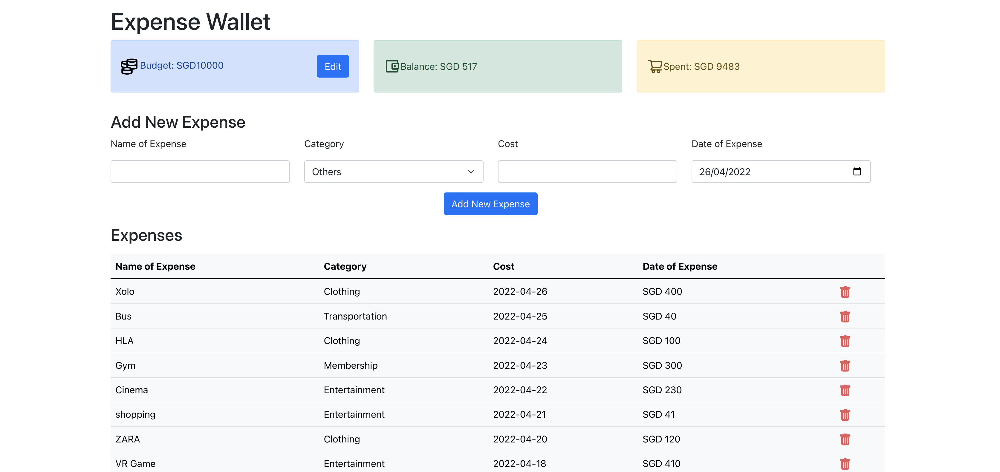
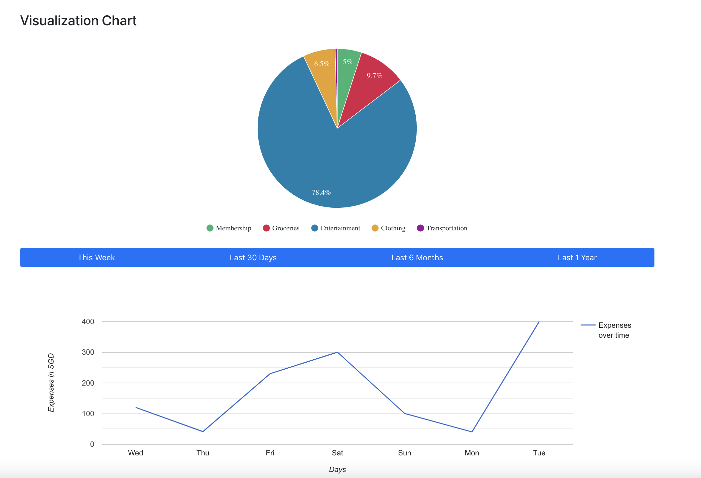
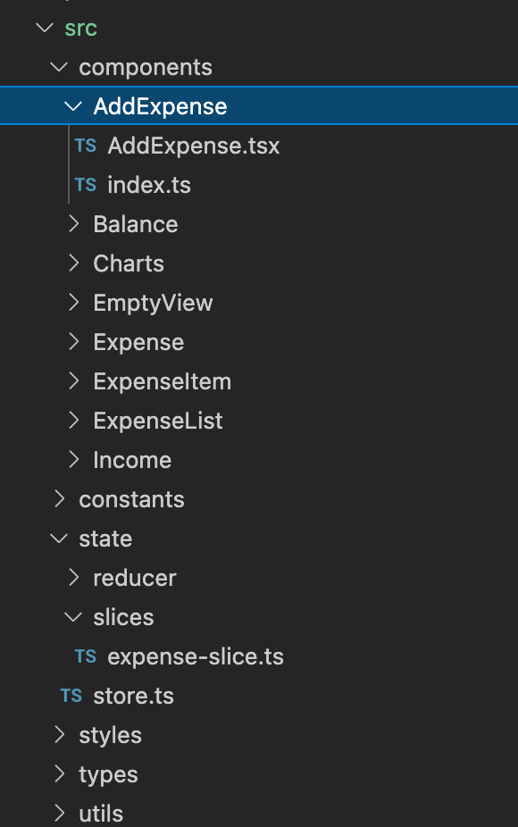
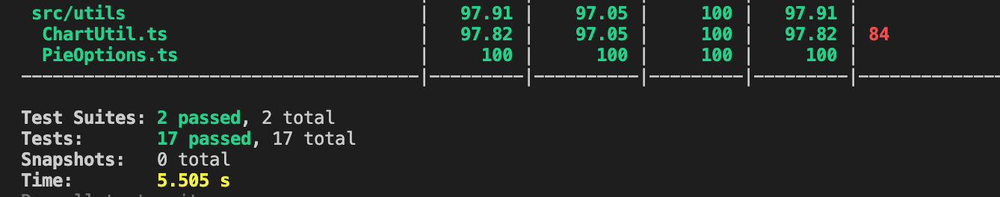
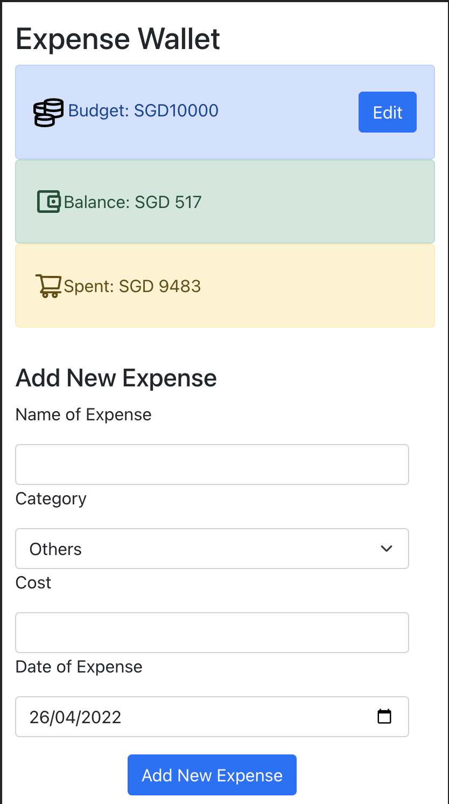
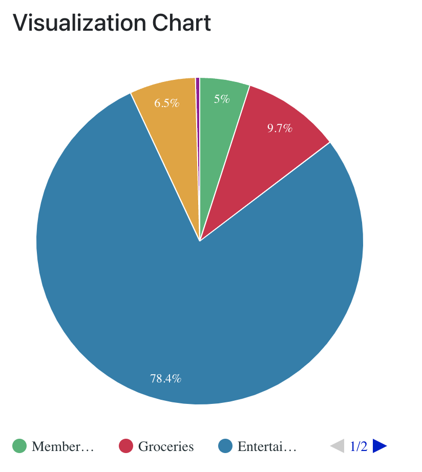

## Expense Wallet

A simple React JS application to keep track of expenses. You can manage expenses and categorize the expenses.

# Visual Representation

A visual representation of the expenses have also been provided which helps to understand expenses over time.

# Project Structure

# Test Report

# Expense Wallet in Mobile Browser

# Getting started

Clone the repository and run npm i to install all the dependencies
Run npm start to start the react app
Navigate to localhost:3000 on your browser

## Available Scripts

In the project directory, you can run:

### `npm start`

Runs the app in the development mode.\
Open [http://localhost:3000](http://localhost:3000) to view it in your browser.

The page will reload when you make changes.\
You may also see any lint errors in the console.

### `npm test`

Launches the test runner in the interactive watch mode.\
See the section about [running tests](https://facebook.github.io/create-react-app/docs/running-tests) for more information.
